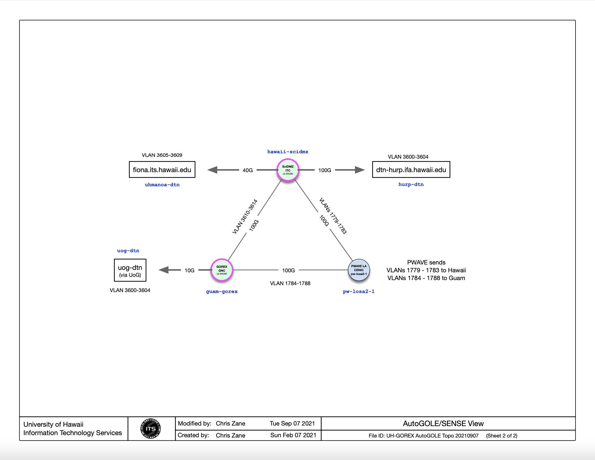

<pre>
guam-gorex is the end point name, using vlans 1784-1788 on LOSA2. 
Endpoint to test to in Guam is uog-dtn, using vlans 3600-3604.

# descr   : Link to PacificWave from GOREX
# name    : pw-losa2-1 (i.e. the remote)
# remote  : pw-losa2-1.pacificwave.net:2016#pw-losa2-1
#         : guam-gorex (name on other nrm file, i.e. facing us)
# label   : vlans 1784-1789
# bw      : 100,000 Mbps
# iface   : et-0/2/0
# attr    : -
#
#
ethernet pw-losa2-1 lsanca.pacificwave.net:2016#pw-losa2-1:guam-gorex(-in|-out) vlan:1784-1788 100000 et-0/0/2 -

# local resources
#

ethernet uog-dtn - vlan:3600-3604 10000 xe-1/0/0 -

</pre>

